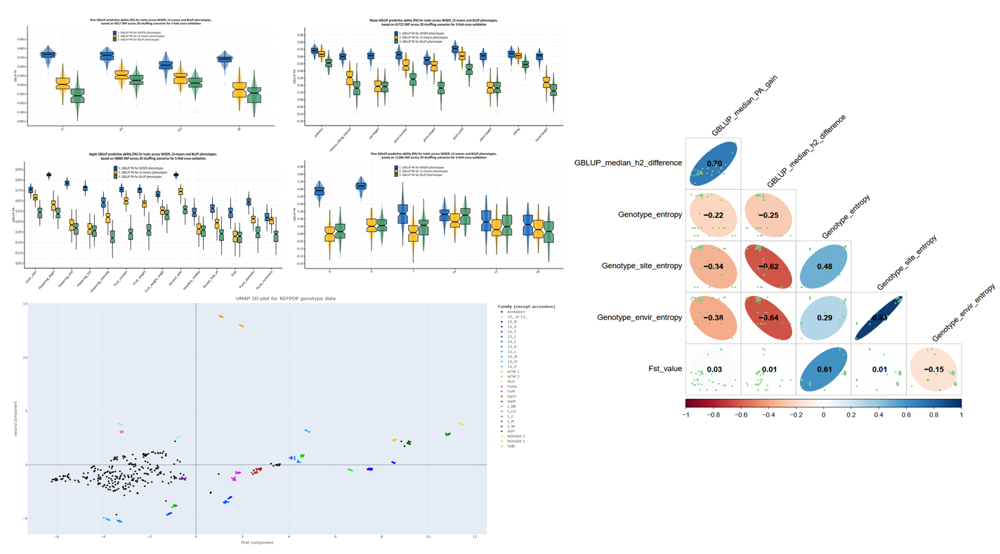

[]()

# compute statistics for WISER publication

### 🎯 Objective

This repository contains R scripts designed for reproducible data analysis and results, aligned with the FAIR principles. These scripts are used to compute the statistics presented in the WISER publication.

### 💻 Instructions

Download the ```compute_stats_wiser_results``` repository in the current user's directory on a computing cluster or personal computer using one of the following commands :

  *  ```git clone git@github.com:ljacquin/compute_stats_wiser_results.git``` <p> </p>
    or
  * ```git clone https://github.com/ljacquin/compute_stats_wiser_results.git``` 
  <p> </p>
  
  ⚠️ Make sure ```git``` is installed beforehand; if not, install it with ```sudo apt install git```.
  <p> </p>

* Given that ```R ≥ 4.1.2``` is already installed, within the ```compute_stats_wiser_results``` folder use the following command to install and test ```compute_stats_wiser_results``` required ```R``` libraries : 

  * ```R -q --vanilla < src/requirements.R```
  * ```R -q --vanilla < src/test_requirements.R```
  <p> </p>

  If a package is missing, you can install it with install.packages("required_package"). Note that the following files in the ```data/``` folder must also be unzipped before launching the computations for the statistics : ```genomic_data_Apple.zip```, ```genomic_data_Maize.zip```, ```genomic_data_Rice.zip``` and ```phenotype_data_Maize.zip```.
  
* The ```R``` script ```src/compute_stats_pa_h2.R``` computes the statistics presented in the WISER publication.

* The ```R``` script ```src/compute_gblup_pa_box_violin_plots.R``` generates box and violin plots for the genomic best linear unbiased predictor (GBLUP) predictive abilities (PA) across traits for each species, based on the different phenotypic estimation methods presented in the publication.

* For computing the statistics using SLURM on a HPC cluster, execute the following commands to make scripts and programs executable :

  *  ```chmod u+rwx src/*.sh```
  <p> </p>

* Finally, execute one of the following commands for launching the computations either locally or on a HPC cluster:

  * ```./src/execute_compute_stats_pa_h2.sh``` (i.e., interactive execution) 
    or
  * ```sbatch src/execute_compute_stats_pa_h2.sh```<p> </p>
  <p> </p>

⚠️ The computation performed by the ```R``` scripts in the ```compute_stats_wiser_results``` repository can be run in either ```Unix/Linux``` or ```Windows``` environments, as long as ```R``` and the necessary libraries are installed. For local computations in ```RStudio```, ensure that the ```computation_mode``` variable is set to "local" in the ```R``` scripts located in ```src/```.

